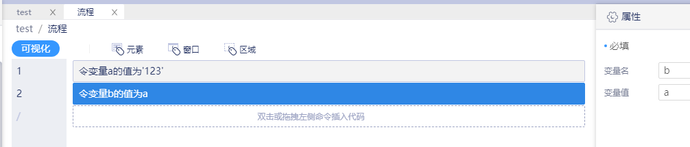
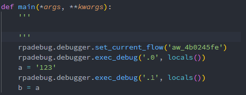

# 变量赋值
---
## 功能说明
对该流程块需要用到的变量进行赋值，可以是局部作用域，也可以是全局作用域。

## 使用说明
### 变量作用域
如果变量名不和全局作用域中的变量名重复，则认为是局部作用域中的变量，只在当前流程块有效；否则直接对全局作用域中的变量进行赋值。

### 变量赋值
直接在右侧属性栏中将需要赋值的变量以及要赋的值填写在变量名和变量值所在的区域，这两个部分会直接成为编译后赋值语句的左右部分。

### 变量值类型
根据变量赋值中的描述，这边的类型是任意的，只要在当前的上下文环境中有定义即可。比如，可以传整数、浮点数、字符串、列表、字典、元组等所有Python内置类型，你甚至可以传一个变量名，只要该变量在前面有定义。比如，先给变量`a`赋值为`123`，然后将变量`a`赋值给变量`b`。

编译生成的代码如图所示：                     

## 注意事项
* 变量命名方式参考[变量窗口](../../2.7.md)一节中的内容
* 局部作用域中的变量只在当前流程块有效，因此多个流程块中可以使用同样的名字（但不能和全局作用域中的冲突）而不会产生副作用