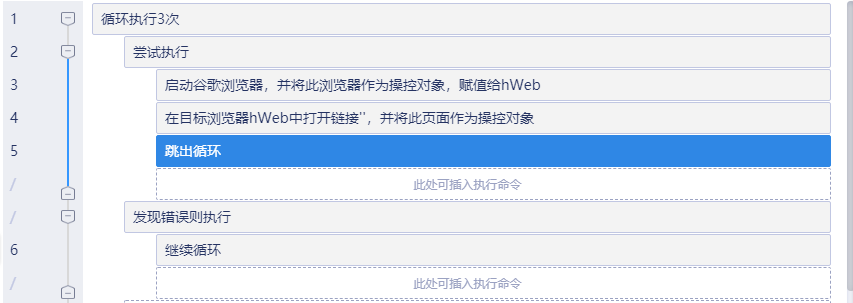
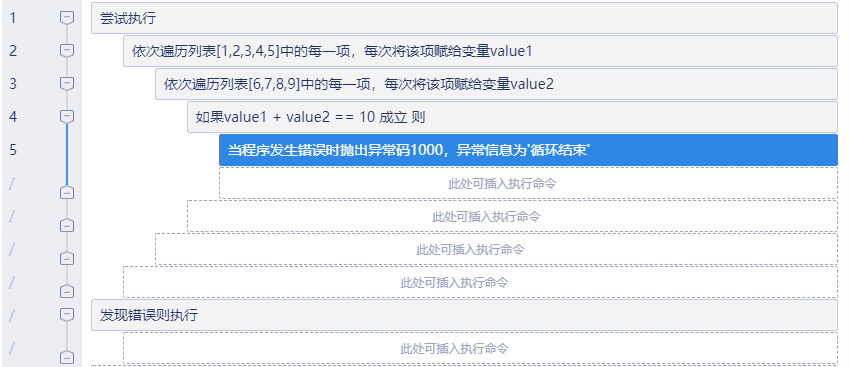

# 捕获异常
---
## 功能说明
捕获异常，尝试执行正常流程中的组件块，当正常流程出现错误，则中断正常执行，开始执行异常块中的组件，您也可以指定当错误发生时重新执行的次数，应尽量保证异常分支中不发生异常。

## 使用说明
* 基本用法：将可能会出现异常的部分放在`尝试执行`下面，出现异常时的处理放在`发现错误则执行`下面。比如，有一个登录过程，有可能会出现某些错误，遇到错误时需要重新登录。这时候我们可以先放一个`计次循环`，然后内部用一个`捕获异常`，`尝试执行`部分是正常的登录过程以及一个`跳出循环`；`发现错误则执行`部分只需要一个`继续循环`即可。看起来是这个样子：                                               

* 高级用法：用来跳出多层循环。假设有两层以上的循环，当我们碰到某种条件时想要跳出所有的循环。我们可以在所有的循环外面放一个`捕获异常`，然后在循环体中碰到某种条件时放一个`抛出异常`组件。看图：                 
